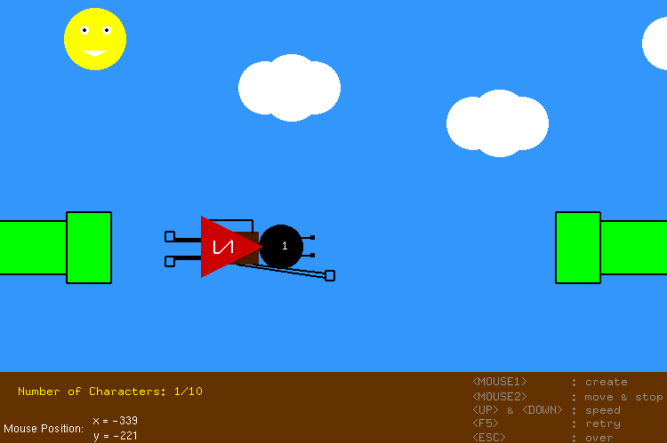
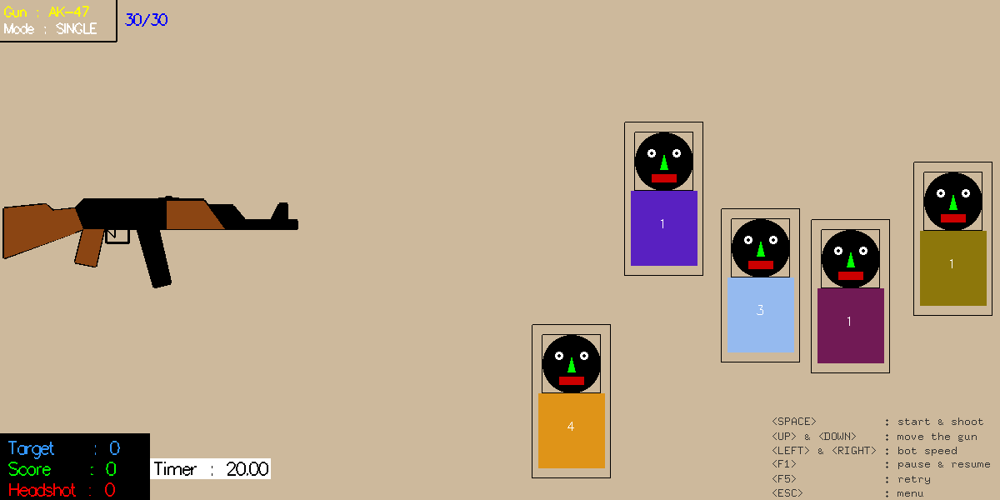

# OpenGL Assignments
CTIS164 - Assignments

There are 4 assignments. You need to install **glut** and **vec.h/vec.cpp** to run these projects.

# 1-SuperSario
- Creating & Moving  

# 2-ShootingRange
- Hitting the Target  

# 3-BattleTank
- Angular Firing  

# 4-ArrowLamp
- Lighting & Chasing  

